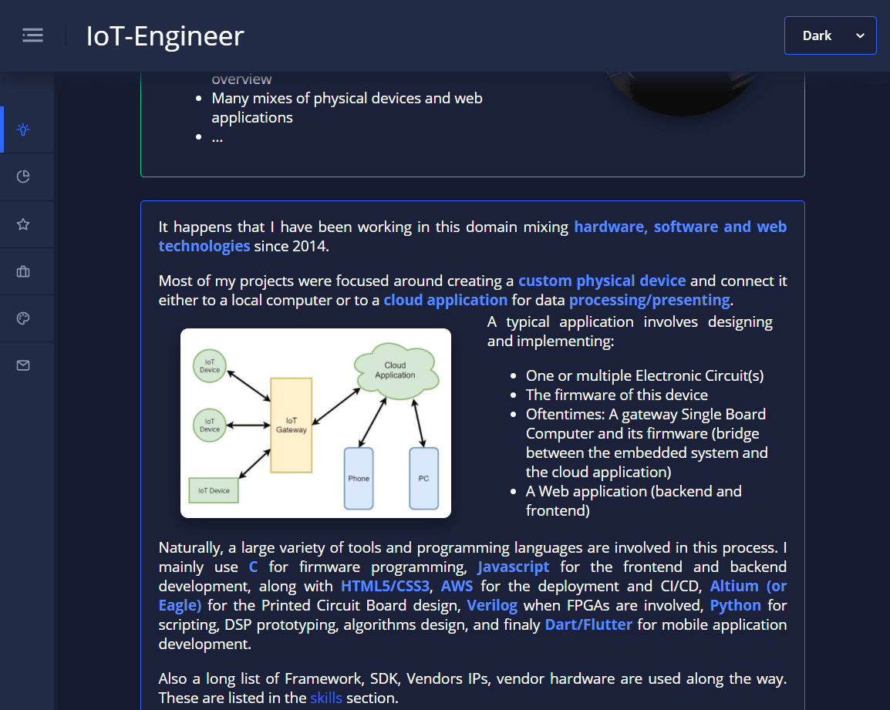

# IoT-Engineer Website

Sources for the static website <a href="https://maximeclement.com">maximeclement.com</a> (Portfolio).

 

 

## Details

Static website made with Angular thanks to <a href="https://akveo.com">Akveo</a>.

Being familiar with the Angular framework I used it for my static website portfolio.

As a side note, lately, I favorise <a href="https://flutter.dev">Flutter</a> for developping UIs.